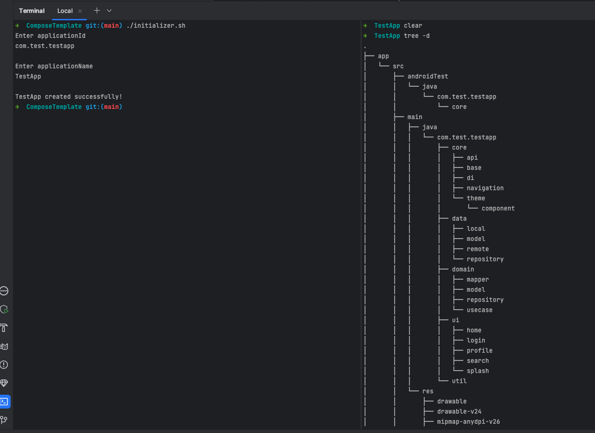

<br/>
<p align="center">
  <h3 align="center">ComposeTemplate</h3>

  <p align="center">
    ComposeTemplate is a Jetpack Compose template application that follows Clean Architecture best practices. It simplifies the process of setting up a well-structured Compose application by providing a template with a predefined folder structure. ✨
    <br/>
    <br/>
    <a href="https://github.com/mustafayigitt/ComposeTemplate/issues">Report Bug</a>
    <a href="https://github.com/mustafayigitt/ComposeTemplate/issues">Request Feature</a>
  </p>
</p>


 


## About The Project



ComposeTemplate is a Jetpack Compose template application that follows Clean Architecture best practices. It simplifies the process of setting up a well-structured Compose application by providing a template with a predefined folder structure. ✨

## Built With


* [Kotlin](https://github.com/JetBrains/kotlin)
* [MVVM](https://developer.android.com/topic/architecture)
* [Jetpack Compose](https://developer.android.com/jetpack/compose)
* [Material 3](https://m3.material.io/)
* [Retrofit](https://github.com/square/retrofit)
* [Hilt](https://developer.android.com/training/dependency-injection/hilt-android)
* [jUnit](https://developer.android.com/training/testing/local-tests)
* [MockK](https://github.com/mockk/mockk)
* [Truth](https://github.com/google/truth)

## Getting Started

To create a new project using this template, follow these steps:

1. Run the `initializer.sh` script.
2. Set the `applicationName` and `applicationId` as prompted.
3. The script will copy a new project with the given credentials 🚀To get a local copy up and running follow these simple example steps.

### Installation

1. Clone the repo

```sh
git clone https://github.com/mustafayigitt/ComposeTemplate.git
```

2. Run `initializer.sh`

3. Open the created project with the given application name.

## Contributing

Contributions are what make the open source community such an amazing place to be learn, inspire, and create. Any contributions you make are **greatly appreciated**.
* If you have suggestions for adding or removing projects, feel free to [open an issue](https://github.com/mustafayigitt/ComposeTemplate/issues/new) to discuss it, or directly create a pull request after you edit the *README.md* file with necessary changes.
* Please make sure you check your spelling and grammar.
* Create individual PR for each suggestion.
* Please also read through the [Code Of Conduct](https://github.com/mustafayigitt/ComposeTemplate/blob/main/CODE_OF_CONDUCT.md) before posting your first idea as well.

### Creating A Pull Request

1. Fork the Project
2. Create your Feature Branch (`git checkout -b feature/AmazingFeature`)
3. Commit your Changes (`git commit -m 'Add some AmazingFeature'`)
4. Push to the Branch (`git push origin feature/AmazingFeature`)
5. Open a Pull Request

## License

This project is licensed under the Apache License 2.0 - see the [LICENSE](LICENSE) file for details.
